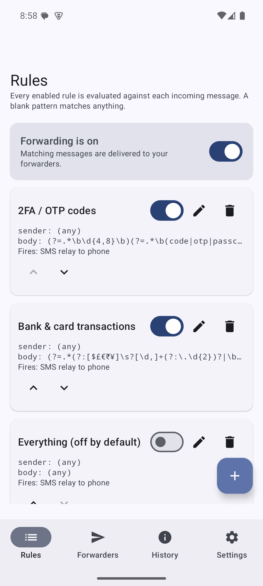
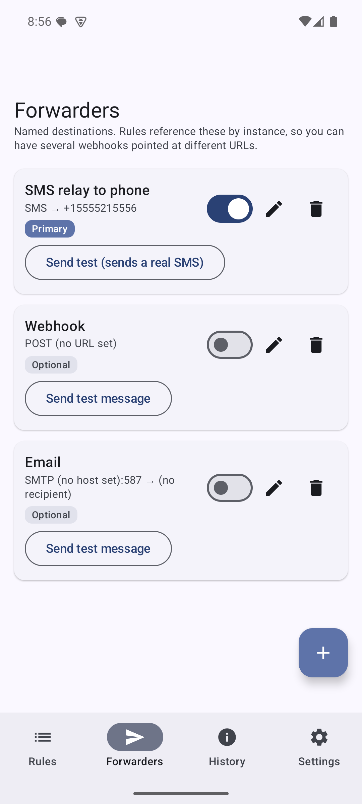
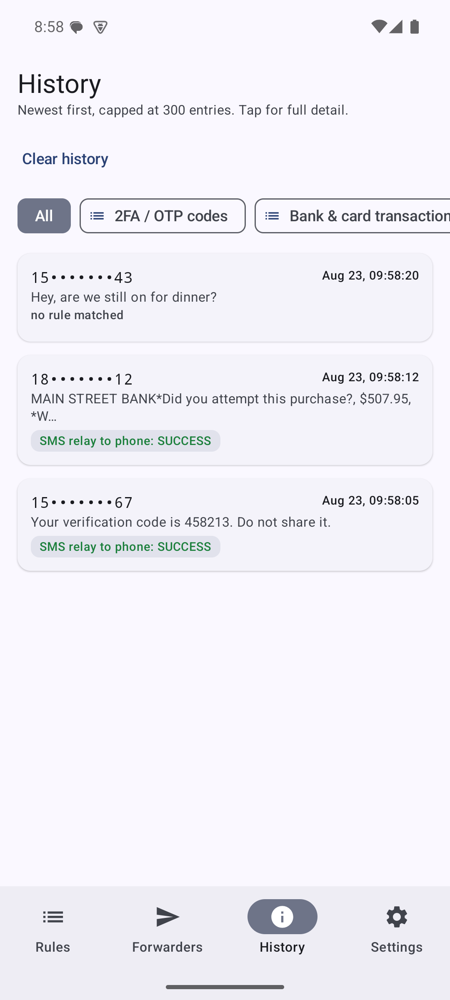
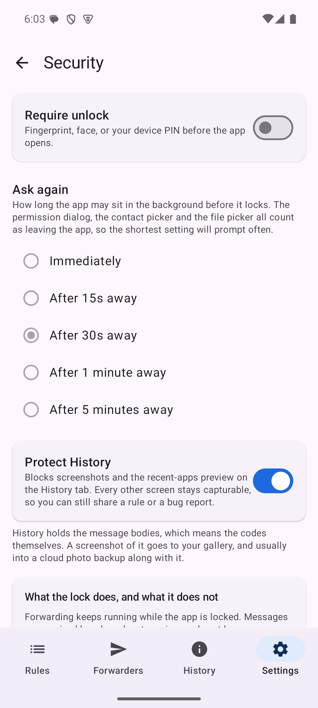
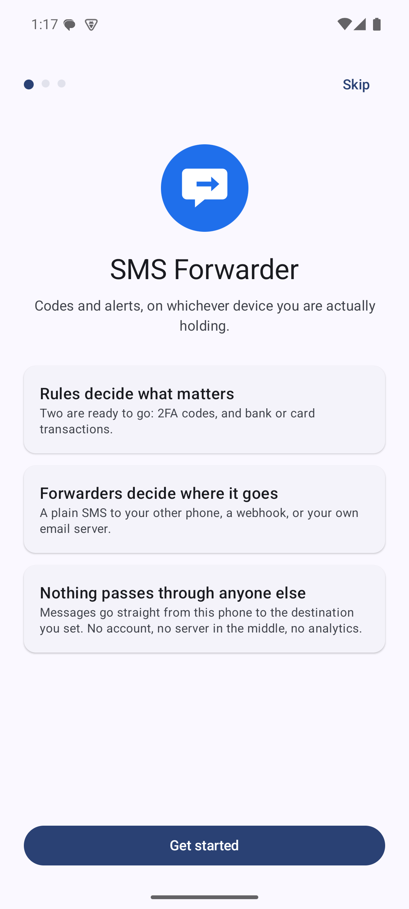

# SMS Forwarder

[](https://github.com/exelaguilar/sms-forwarder/actions/workflows/build.yml)
[](LICENSE)
[](#install)

**Never miss a 2FA code again.** An Android app that watches incoming SMS, matches the
ones you care about, and forwards them where you actually are — your other phone, a
webhook, or your inbox.

Built for the classic problem: your bank sends the OTP to your Android, but you're on
your iPhone, laptop, or desk. This forwards it in seconds, with no service in the middle.

<table>
  <tr>
    <td></td>
    <td></td>
    <td></td>
    <td></td>
  </tr>
  <tr>
    <td align="center"><sub><b>Rules</b></sub></td>
    <td align="center"><sub><b>Forwarders</b></sub></td>
    <td align="center"><sub><b>History</b></sub></td>
    <td align="center"><sub><b>Security</b></sub></td>
  </tr>
</table>

---

## Features

**Three ways to forward**

| | |
|---|---|
| **SMS relay** | Sends a plain SMS to another number using your own carrier connection. Nothing to install on the receiving end — works with iPhone, Android, a dumbphone, anything. |
| **Webhook** | POST/PUT/GET to any URL, with your own headers and a JSON body template. |
| **Email** | Your own SMTP server. App passwords, self-hosted, or a local catcher for testing. |

You can configure several instances of each — two webhooks pointing at different URLs,
say — and every rule picks which ones it fires.

**Rules that match what you want**

- Two rules ready out of the box: **2FA/OTP codes** and **bank & card transactions** —
  the latter also catches fraud-verification texts ("Did you attempt Zelle $2,000.00…"),
  which carry an amount but often no transaction verb at all
- Match the sender by **regex, exact number, or contact** — with an *exclude* list, so
  "everything except this contact" is a rule you can actually express
- Excluding a contact excludes **every** number on it, not just one
- Body matching by regex, validated as you type, with a built-in tester that tells you
  *which half* of a rule failed
- Reorder rules; order decides which one is credited when two would deliver the same thing
- Any rule can fire any combination of forwarders
- Save a rule that already has an equivalent and the app says so, naming the existing
  rule — and tells you whether it fires the same forwarders or different ones

**Delivery you can actually verify**

- History log of every message: what matched, what fired, and whether it worked —
  filterable by rule or forwarder
- The SMS relay reports the *carrier's* verdict — `carrier accepted 2/2 part(s); delivered`
  — not just "the API call didn't throw", and reports it as soon as it knows
- Automatic retry with exponential backoff, so a dropped connection doesn't lose a code
- Misconfiguration fails immediately with the reason, instead of retrying forever
- Optional notification when a forward finally gives up, because the worst failure is a
  silent one — plus a Retry button on any failed attempt
- **Global pause** for when you're travelling or lending the phone. Messages are still
  matched and logged, so you can see what you missed; nothing is delivered.

**It tells you when it isn't working**

- A three-step guide on first launch: what it does, the permissions it needs, and the
  number to forward to. Skippable, and re-runnable any time from **Settings → Setup guide**.
- If the SMS permissions aren't granted, a banner on Rules and Forwarders says so in plain
  words, with a one-tap fix. If Android has stopped showing the permission dialog — which
  it does after two refusals — the button becomes **Open app settings** instead of a button
  that does nothing.
- A forwarder that can't possibly work says why on its own card. One with no destination
  number *refuses* to switch on and opens its editor instead, because that one is certain
  to fail and you can fix it right there. A missing permission only warns, because you
  might grant it in a minute and nobody's setup should switch itself off in the meantime.

**Locked when you want it**

- Optional **app lock**: fingerprint, face, or your device PIN before the app opens
- Choose how long it may sit in the background first — instantly, or up to five minutes —
  so stepping out to a permission dialog doesn't mean authenticating again
- **Forwarding carries on while the app is locked.** Receiving and sending don't involve
  the screen, so a locked phone still forwards your codes.
- Separately, **History blocks screenshots and the recent-apps preview** — it's the one
  screen holding message bodies, and a screenshot of it goes to your gallery and usually
  to a cloud photo backup with it. Every other screen stays capturable, so you can still
  share a rule or a bug report. One toggle turns it off.

**Yours to keep**

- Export and import your configuration. Credentials are excluded by default and history
  never leaves the device.

**Test it without waiting for a real SMS**

- Built-in simulator runs a message you type through the entire pipeline
- "Send test message" on each forwarder verifies credentials and connectivity on demand

**Made yours**

- Material You on Android 12+, or pick any accent colour — **type or paste a hex code**,
  or nudge the RGB sliders. Contrast is enforced automatically, so no choice can make the
  app unreadable.
- Three app icons — blue, graphite, or light — swapped from **Settings → Appearance**
- Destination numbers are remembered, so the second and third forwarder to the same
  handset are a dropdown rather than retyping
- Duplicate suppression: when several rules match one message, the same destination is
  only delivered to once

---

## Install

Requires Android 8.0 (API 26) or newer.

**Download the signed APK from [Releases](../../releases)**, then either tap it on the
phone (you'll need to allow installs from your browser or file manager) or sideload it:

```bash
adb install -r sms-forwarder-v1.2.0.apk
```

Or build it yourself:

```bash
./gradlew assembleDebug
```

> Releases are self-signed, so Android will warn that the app is from an unknown
> developer — expected for anything not distributed through Play. Each release lists its
> certificate SHA-256 so you can confirm the APK is the one that was published.

## Quick start



The app walks you through the first three steps on launch — what it does, granting the SMS
permissions, and the number to forward to. You can skip it and come back later from
**Settings → Setup guide**.

After that:

1. **Rules tab** → the OTP and bank rules are on by default. Use *Test this pattern* in
   the rule editor to try a message against your edits without sending anything.
2. **Settings → Simulate an incoming SMS** → runs the whole pipeline for real.
3. Send yourself a real SMS and check the **History tab**.

If anything is missing, you won't have to go looking: a banner on Rules and Forwarders
names the problem and offers the fix.

> Both default rules are on, so a matching message costs one relay SMS each. Turn the
> bank rule off, narrow it, or use the global pause on the Rules tab if that isn't what
> you want.

<br clear="right">

---

## Privacy

This app exists because forwarding OTP codes through someone else's server is a bad idea.

- **No cloud service in the middle.** Messages go straight from your phone to the
  destination *you* configure.
- **No analytics, no telemetry, no crash reporting, no ads.** No SDKs beyond an HTTP
  client, an SMTP client, and Jetpack.
- **Secrets stay encrypted.** SMTP credentials, webhook headers, and the message history
  live in `EncryptedSharedPreferences`, backed by the Android Keystore.
- **No cloud backup.** Backup and device-transfer are switched off, so your codes aren't
  copied off the device.
- **Four required permissions, all load-bearing.** `RECEIVE_SMS` and `READ_SMS` to see
  messages, `SEND_SMS` only for the relay forwarder, `INTERNET` for webhook and email.
- **Optional app lock.** Biometrics or your device PIN before the app opens, and the app
  is hidden from the recent-apps preview while it's armed. It guards the app's screens; it
  is not what encrypts your data, which happens either way.
- **Two optional ones, never requested until used.** `READ_CONTACTS` only if you want a
  name next to an incoming number, `POST_NOTIFICATIONS` only if you want failure alerts.
  Decline either and everything else works unchanged. Matching a rule against a contact
  needs no permission at all — contacts are picked, not read.

About 4,000 lines of Kotlin excluding comments and imports, in 41 files, with no
dependency injection framework and no database. It is meant to be readable end to
end rather than merely open source.

## Good to know

- **It sends plain SMS, not RCS or iMessage.** Android has no public API for sending RCS
  from a third-party app, so this isn't a limitation that can be fixed. Plain SMS lands
  on any handset regardless of what messaging app the recipient uses.
- **The SMS relay costs whatever your plan charges per message.** Every forwarded code is
  a billable SMS. Check international rates before pointing it at a foreign number.
- **Forwarding OTP codes reduces their security.** A code sent to a second device is a
  code in two places. Use the tightest rule that does the job, and prefer the SMS relay or
  your own server over a third-party webhook.
- **Battery optimisation can delay forwards.** If you see minutes-late delivery, set the
  app to "Unrestricted" under Settings → Apps → SMS Forwarder → Battery.

## Documentation

- **[DEVELOPMENT.md](DEVELOPMENT.md)** — architecture, build setup, the four-layer test
  strategy, and troubleshooting.

## License

MIT — see [LICENSE](LICENSE).
